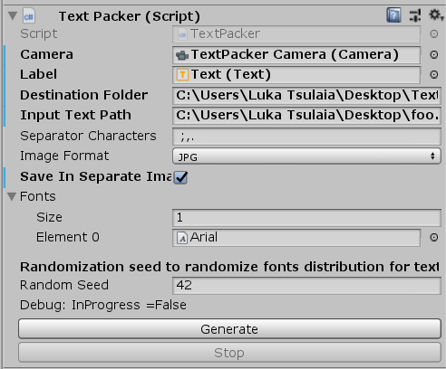

# TextRenderer
Render images of text. Can be useful for OCR projects. Uses Unity3D

Is using entire game engine to generate images from text and overkill? It absolutely is. But hey, it's simple to use and it works.

* Multiple font support
* Settings seed for generating words with same distribution of fonts
* Ability to save generated images in jpg/png

* SHOWS PROGRESS!
